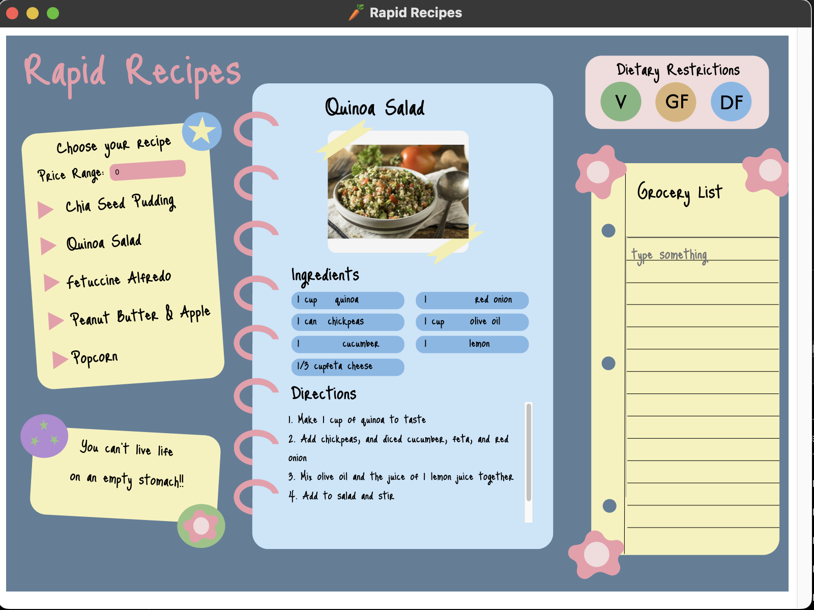
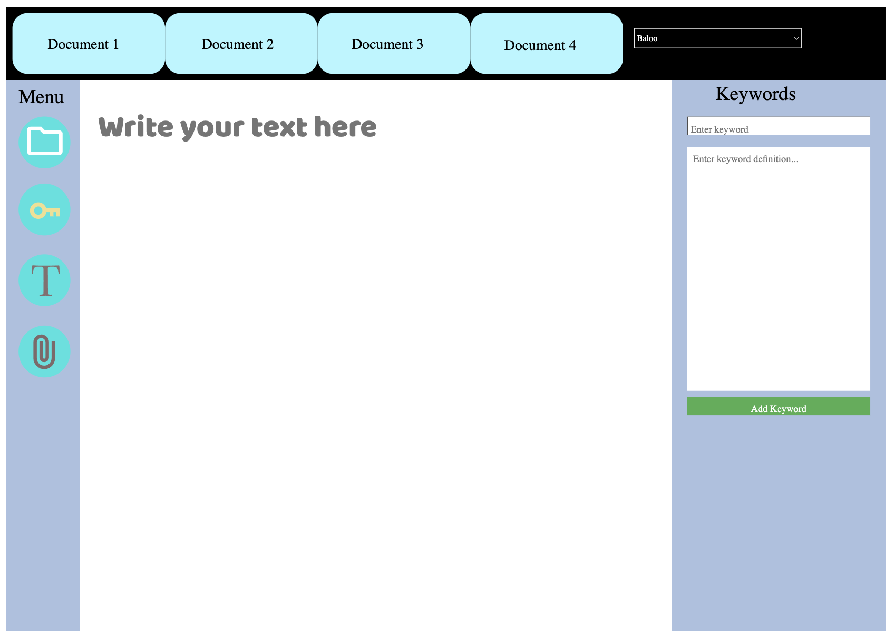

# ARTSSCI 3C03 - Apps Showcase 2025

Welcome to our app showcase! Here are 9 amazing apps created by ARTSSCI 3C03 students.

  
  

    
    <h3>🥕 Rapid Recipes App</h3>
    
Short description of App 1.

    
<strong>Creators:</strong> Student Names

    <a href="app1-download-link" target="_blank">Download for macOS</a>
  

  

    
    <h3>🥗 Healthy Meal Ration Calculator</h3>
    
Short description of App 2.

    
<strong>Creators:</strong> Student Names

    <a href="app2-download-link" target="_blank">Download</a>
  

  

    
    <h3>🧠 Anatomy Lab</h3>
    
Anatomy Lab is an interactive app designed to explore the human body.

    
<strong>Creators:</strong> Harmil Kalia, Ally Pei-Middleton, and Nimra Atiq

    <a href="https://mcmasteru365-my.sharepoint.com/:u:/g/personal/navarrol_mcmaster_ca/EQ3YscxWEwdJgLI4sd5PIH4B5dAGOeHQ4B5eJlWzSE19mg?e=taudje" target="_blank">Download for MacOS</a>
  

  

    
    <h3>😺 Mellow The App</h3>
    
Short description of App 4.

    
<strong>Creators:</strong> Student Names

    <a href="app4-download-link" target="_blank">Download</a>
  

  

    
    <h3>📍Explore Toronto App</h3>
    
Short description of App 5.

    
<strong>Creators:</strong> Student Names

    <a href="app5-download-link" target="_blank">Download</a>
  

  

    
    <h3>🌱 Plant Care App</h3>
    
Short description of App 6.

    
<strong>Creators:</strong> Student Names

    <a href="app6-download-link" target="_blank">Download</a>
  

  

    
    <h3>📝 Word Processor App</h3>
    
Short description of App 7.

    
<strong>Creators:</strong> Student Names

    <a href="app7-download-link" target="_blank">Download</a>
  

  

    
    <h3>🌦️ The Weather App</h3>
    
Short description of App 8.

    
<strong>Creators:</strong> Student Names

    <a href="app8-download-link" target="_blank">Download</a>
  

  

    
    <h3>🧐 Fake or Fact App</h3>
    
Short description of App 9.

    
<strong>Creators:</strong> Student Names

    <a href="app9-download-link" target="_blank">Download</a>
  

